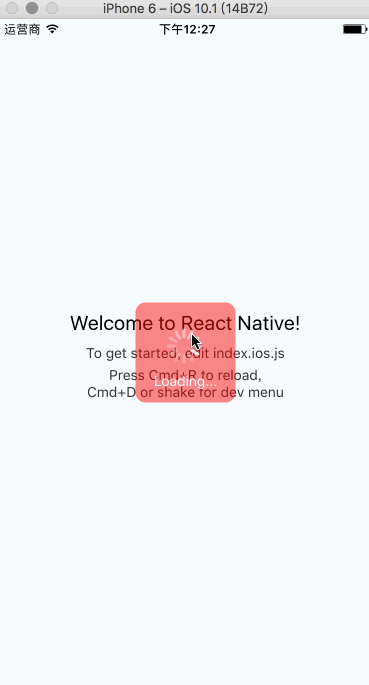
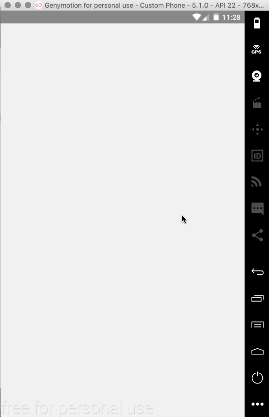

#React-native-easy-loading

[](https://badge.fury.io/js/react-native-easy-loading)

适用iOS、Android

## 有问题反馈
在使用中有任何问题，欢迎反馈给我，也可以用以下联系方式跟我交流

* 邮件(Netxy#vip.qq.com, 把#换成@)
* QQ: 850265689

## 添加到项目中

1. Run `npm install react-native-easy-loading --save` or `yarn add react-native-easy-loading`
2. `var { Loading, EasyLoading } = require('react-native-easy-loading');`


## 属性

- **`type`** _(String)_ - 用来区分不同Loading组件。
- **`color`** _(String)_ - 转圈的颜色，默认:`"#FFF"`。
- **`textStyle`** _(Object)_ - 提示字样式。
- **`loadingStyle`** _(Object)_ - 外层盒子样式。


## 方法

- **`show(text:string = 'Loading...',timeout:number = -1,key:string = 'default')`** - 显示`Loading...`
- **`dismis(key:string = 'default')`** - 关闭


## 使用

```javascript

import { Loading, EasyLoading } from 'react-native-easy-loading';

class App extends Component {
    componentDidMount() {
		EasyLoading.show('Loading...', 3000, 'type');
		setTimeout(() => {
			EasyLoading.show('Loading...', 3000);
		}, 3000)
	}
	render() {
		return (
			<View style={styles.container}>
				<Text style={styles.welcome}>Welcome to React Native!</Text>
				<Text style={styles.instructions}>To get started, edit index.android.js</Text>
				<Text style={styles.instructions}>Double tap R on your keyboard to reload,{'\n'}Shake or press menu button for dev menu</Text>
				<Loading />
				<Loading type={"type"} loadingStyle={{ backgroundColor: "#f007" }} />
			</View>
		);
	}
}
```

## 录屏


